# Game Recommendation System 🎮

A sophisticated game recommendation system that combines K-Means clustering and Nearest Neighbors to provide personalized game recommendations. The system addresses the challenge of decision paralysis faced by players when navigating vast game libraries by offering tailored suggestions based on game attributes and user preferences.

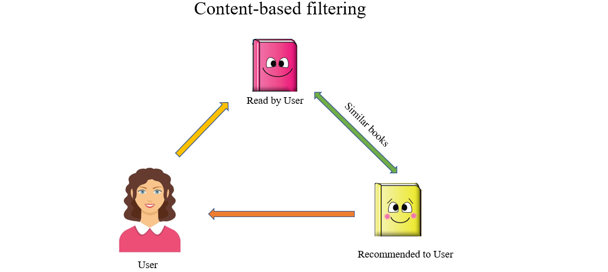
<!-- Add a banner image showcasing game recommendation concept -->

## 📑 Table of Contents
- [Motivation](#-motivation)
- [Project Structure](#-project-structure)
- [Literature Review](#-literature-review)
- [Dataset Description](#-dataset-description)
- [Methodology](#️-methodology)
- [Iterative Model Development](#-iterative-model-development)
- [Results and Analysis](#-results-and-analysis)
- [Getting Started](#-getting-started)
- [Team Members](#-team-members)
- [Future Work](#-future-work)
- [References](#-references)

## 🎯 Motivation

The gaming industry's exponential growth has led to an overwhelming number of choices for players. Our project addresses this challenge by:
- Helping players navigate extensive game libraries effectively
- Reducing decision paralysis through personalized recommendations
- Supporting discovery of both popular and niche titles
- Leveraging machine learning to understand and match player preferences

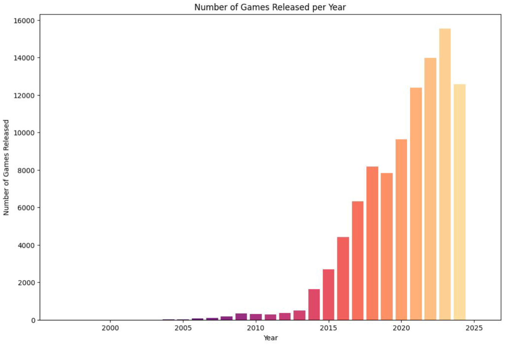
<!-- Add graph showing exponential growth in game releases -->

## 📊 Project Structure
```
game-recommendation-system/
├── data/
│   ├── final_data.csv
│   ├── games_with_reviews.csv
│   ├── games.csv
│   └── processed_game_data.csv
├── indexdir/
│   ├── _MAIN_1.toc
│   ├── MAIN_ez3ijabrp49e5se8.seg
│   └── MAIN_WRITELOCK
├── pickle/
│   └── kmeans_model.pkl
├── src/
│   ├── collaborative_filtering.ipynb
│   ├── data_scraping.py
│   ├── eda.ipynb
│   ├── main.ipynb
│   └── main2.ipynb
├── txt/
│   ├── notes.md
│   ├── output.txt
│   ├── testing.txt
│   └── user_agents.txt
└── documentation/
    ├── ML_Project_proposal.pdf
    ├── Project_Presentation.pdf
    └── Project_Report.pdf
```

## 📚 Literature Review

Our approach is informed by several key research papers:

1. **Machine-Learning Item Recommendation System for Video Games**
   - Explores ERT and DNN models for personalized recommendations
   - Focuses on real-time user behavior adaptation
   - ERT model showed superior accuracy and scalability

2. **Content-Based and Context-Based Recommendation Systems**
   - Reviews various recommendation techniques
   - Addresses challenges like information overload
   - Emphasizes importance of contextual information

3. **STEAM Game Recommendations**
   - Investigates recommender systems for the STEAM platform
   - Tests various models including FM, DeepNN, and DeepFM
   - Found DeepNN performs best for accuracy and novelty


<!-- Add visualization summarizing key papers and findings -->

## 🔍 Dataset Description

### Content-Based Filtering Dataset
- Source: Video Games Recommendation System (Kaggle)
- Features:
  ```
  name | release_date | price | dlc_count | detailed_description | about_the_game
  windows | mac | linux | achievements | supported_languages | developers
  publishers | categories | genres | estimated_owners | average_playtime_forever
  ```

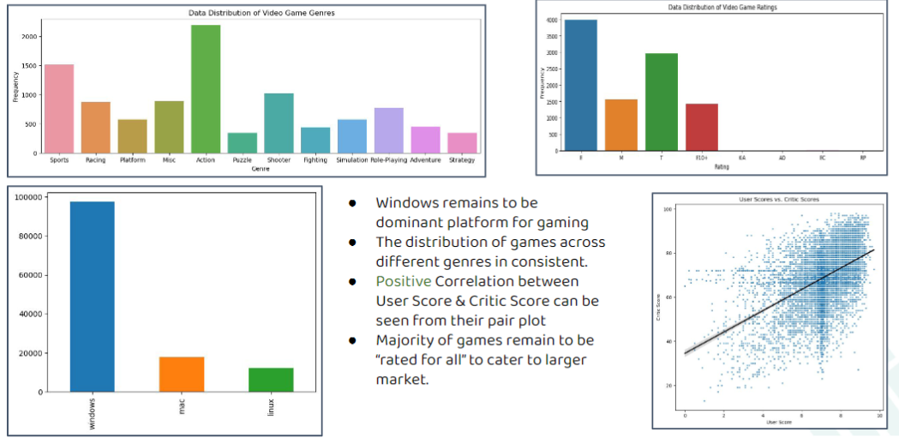
<!-- Add visualization of key dataset features -->

### Collaborative Filtering Dataset
- Source: Steam Store
- Contents:
  - 41 million user recommendations
  - Game metadata
  - User profiles
  - Review data

### Data Distribution Analysis

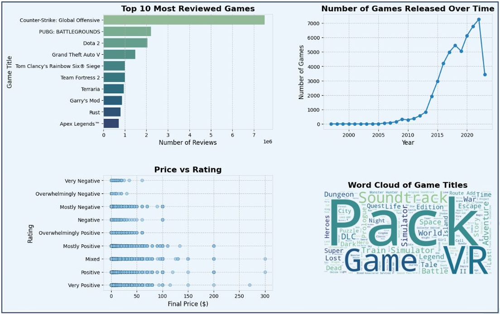
<!-- Add platform distribution chart -->

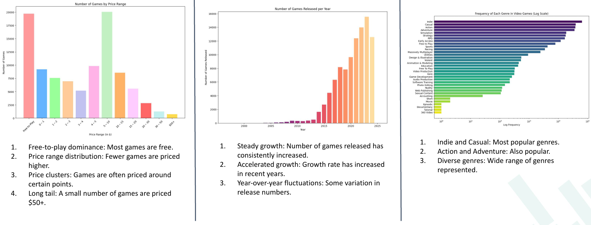
<!-- Add genre distribution chart -->

<!-- 
Add price distribution chart -->

## 🛠️ Methodology
### Data Preprocessing

### Initial Features

- **Numerical Features**: `Price`, `Release Year`
- **Categories & Genres**: A list of categories & genres that a game belongs to.
- **Platform**: 0/1 Binary features for the availability of `Windows`, `Mac`, `Linux`.
- **Publishers & Studios**: A list of publishers & studios that a game belongs to.
- **PlayTime**, **Description**, **Supported Languages**: Other features that were either missing for many entries or not relevant.

---

#### Data Normalization

To ensure equal contribution of all features during clustering, numerical features like `Price` and `Release Year` were normalized. Binary features like `Categories`, `Genres`, and platform support were normalized using `StandardScaler`. This prevented any single feature or group of features from disproportionately influencing the clustering process.

---

#### Processed Columns

| #   | Column Name                          | Dtype   | Description              |
| --- | ------------------------------------ | ------- | ------------------------ |
| 1   | `windows`                            | `int64` | Binary feature for Windows |
| 2   | `mac`                                | `int64` | Binary feature for Mac     |
| 3   | `release_year`                       | `int64` | Year of game release       |
| 4   | `linux`                              | `int64` | Binary feature for Linux   |
| 5   | `price`                              | `float64` | Price of the game          |
| 6   | `categories`                         | `object` | Categories list            |
| 7   | `genres`                             | `object` | Genres list                |
| 8   | `game_studios`                       | `object` | Associated game studios    |
| 9   | `categories_includes_level_editor`   | `int64`  | Level editor feature       |
| 10  | `categories_<category_name>`         | `int64`  | One-hot encoded categories |
| ... | ...                                  | ...     | ...                        |
| 52  | `genres_nudity`                      | `int64`  | Binary for genre: nudity   |
| 53  | `genres_casual`                      | `int64`  | Binary for genre: casual   |
| 54  | `genres_short`                       | `int64`  | Binary for genre: short    |
| 55  | `genres_video_production`            | `int64`  | Binary for genre: video production |
### Initial Features

- **Numerical Features**: `Price`, `Release Year`
- **Categories & Genres**: A list of categories & genres that a game belongs to.
- **Platform**: 0/1 Binary features for the availability of `Windows`, `Mac`, `Linux`.
- **Publishers & Studios**: A list of publishers & studios that a game belongs to.
- **PlayTime**, **Description**, **Supported Languages**: Other features that were either missing for many entries or not relevant.

---

#### Data Normalization

To ensure equal contribution of all features during clustering, numerical features like `Price` and `Release Year` were normalized. Binary features like `Categories`, `Genres`, and platform support were normalized using `StandardScaler`. This prevented any single feature or group of features from disproportionately influencing the clustering process.

---

#### Processed Columns

| #   | Column Name                          | Dtype   | Description              |
| --- | ------------------------------------ | ------- | ------------------------ |
| 1   | `windows`                            | `int64` | Binary feature for Windows |
| 2   | `mac`                                | `int64` | Binary feature for Mac     |
| 3   | `release_year`                       | `int64` | Year of game release       |
| 4   | `linux`                              | `int64` | Binary feature for Linux   |
| 5   | `price`                              | `float64` | Price of the game          |
| 6   | `categories`                         | `object` | Categories list            |
| 7   | `genres`                             | `object` | Genres list                |
| 8   | `game_studios`                       | `object` | Associated game studios    |
| 9   | `categories_includes_level_editor`   | `int64`  | Level editor feature       |
| 10  | `categories_<category_name>`         | `int64`  | One-hot encoded categories |
| ... | ...                                  | ...     | ...                        |
| 52  | `genres_nudity`                      | `int64`  | Binary for genre: nudity   |
| 53  | `genres_casual`                      | `int64`  | Binary for genre: casual   |
| 54  | `genres_short`                       | `int64`  | Binary for genre: short    |
| 55  | `genres_video_production`            | `int64`  | Binary for genre: video production |


### Content-Based Filtering
1. **Feature Engineering**
   - Numerical features: Price, Release Year
   - Binary features: Platform support, categories, genres
   - Studio clustering using K-Means++

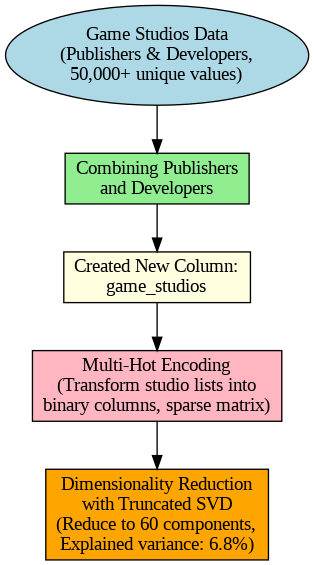

<!-- 
Add visualization of feature engineering process -->

1. **Dimensionality Reduction**
   - Applied Truncated SVD
   - Reduced studio data to 60 components
   - Achieved 6.8% explained variance

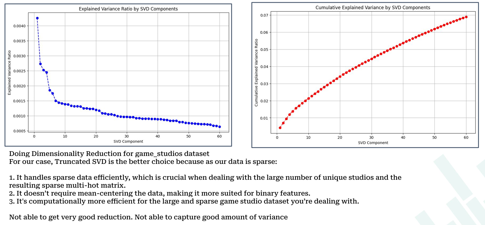
Add SVD variance explanation chart

## 🔄 Iterative Model Development

### Initial Challenges & Solutions

#### 1. Random Initialization Problems
   1.  Arriving at global minima through random initialization is not 
guaranteed, and in most cases, it is **highly unlikely**
  1. Noticed poor inter-cluster similarity using Silhouette Analysis.
  2. **Non-Convex Optimization Problem**
      - **Multiple local minima exist**
      - Final clustering highly dependent on initial centroid positions
      - May lead to:
        - **Splitting** of a single cluster
        - **Merging** of two clustersRandom centroid initialization when doing clustering has some shortcomings.
   3. **Solution**: K-Means++ Algorithm implementation improves clustering by initializing centroids in a smarter, probabilistic way that ensures they are spread out, reducing the chances of poor convergence and suboptimal clusters. It results in faster convergence and better clustering quality compared to random initialization in standard K-Means.

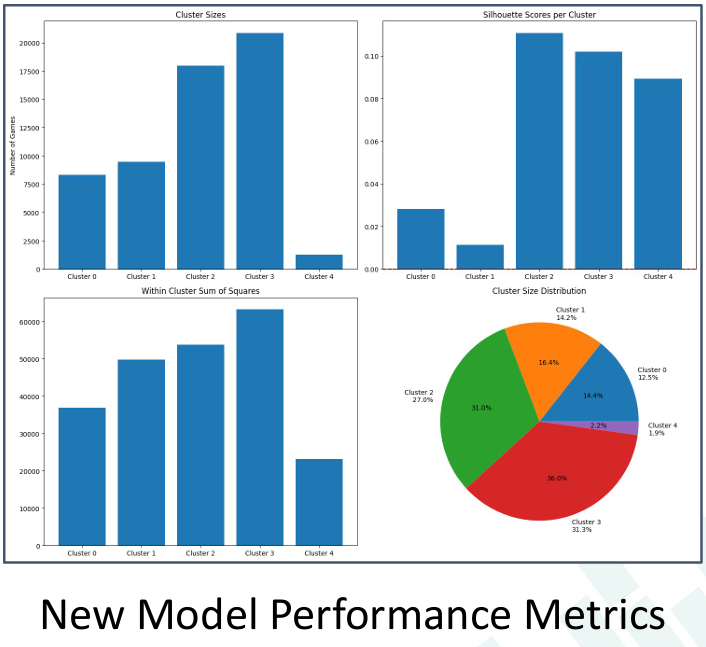
<!-- Add visualization comparing different clustering results -->

#### 2. Distance Metric Selection
- Evaluated multiple distance metrics:
  ```python
  # Distance metric comparison
  metrics = {
      'euclidean': euclidean_distances,
      'manhattan': manhattan_distances,
      'cosine': cosine_distances
  }
  ```

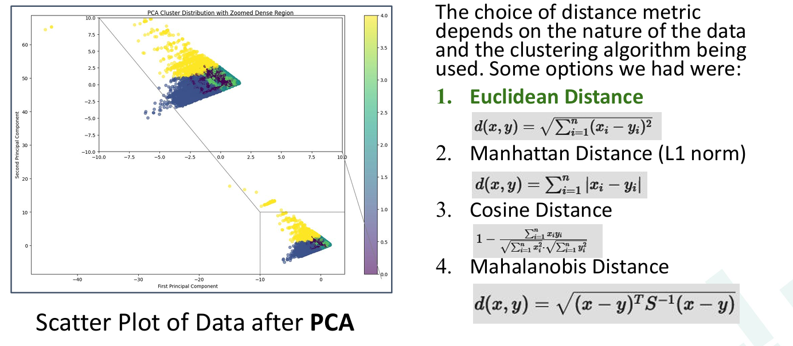
<!-- Add comparison of different distance metrics -->

### Model Comparison With GMM(Gaussian Mixture Models)


<!-- Add visualization showing model improvement over iterations -->

### Performance Analysis
```
Cluster-wise Silhouette Analysis:
- Cluster 1.0: 0.263 (46,626 games) - Good structure
- Cluster 3.0: 0.108 (16,156 games) - Normal structure
- Cluster 4.0: 0.065 (1,612 games) - Normal structure
- Cluster 2.0: 0.043 (19,331 games) - Weak structure
- Cluster 0.0: -0.010 (13,679 games) - Potential misclassification
```

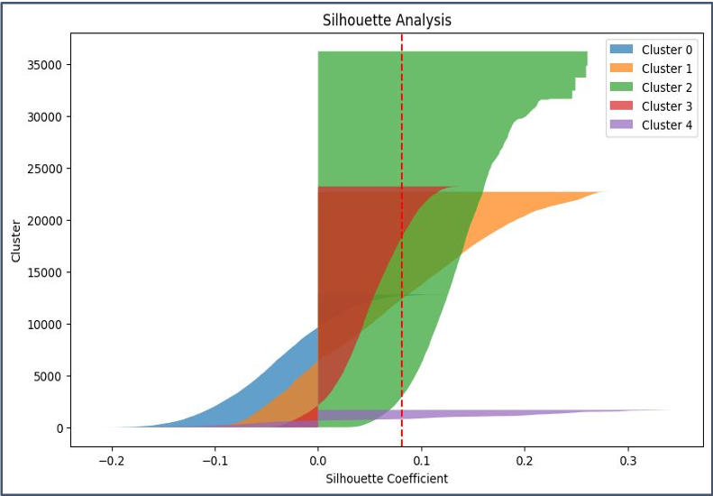
<!-- Add silhouette analysis visualization -->

## 🚀 Getting Started

### Prerequisites
```bash
python>=3.8
numpy
pandas
scikit-learn
scipy
whoosh
```

### Installation
1. Clone the repository
```bash
git clone [your-repository-link]
cd game-recommendation-system
```

2. Install required packages
```bash
pip install -r requirements.txt
```

### Usage Example
```python
from src.recommender import GameRecommender

# Initialize the recommender
recommender = GameRecommender()

# Get recommendations for a game
recommendations = recommender.get_recommendations("FIFA")

# Example output:
# 1. FIFA 23 (Match Score: 0.89)
# 2. Pro Evolution Soccer 2023 (Match Score: 0.82)
# 3. FIFA 22 (Match Score: 0.81)
```

## 👥 Team Members

### Aditya Sharma (2022038)
- Data preprocessing
- Feature engineering
- Clustering analysis
- Model development
- EDA, SVD, fuzzy search

### Kanishk Kumar Meena (2022233)
- Data cleaning
- Collaborative Filtering
- Model evaluation

### Vansh Aggarwal (2022558)
- Dataset management
- Visualization
- EDA
- Performance Testing

## 🔮 Future Work

1. Integration of user interaction data for hybrid recommendations
2. Enhancement of clustering algorithms for better game categorization
3. Implementation of real-time recommendation updates
4. Addition of more sophisticated feature engineering techniques
5. Development of a user interface for easier interaction


<!-- Add visualization of future development roadmap -->

## 📊 Sample Run
1. The model runs for the query ``"fifa"``.
2. The model first fixes the nearest matching strings available in the database for the query name.
3. It uses the top match to find the top recommendations, which are then **sorted in order of critic score**.
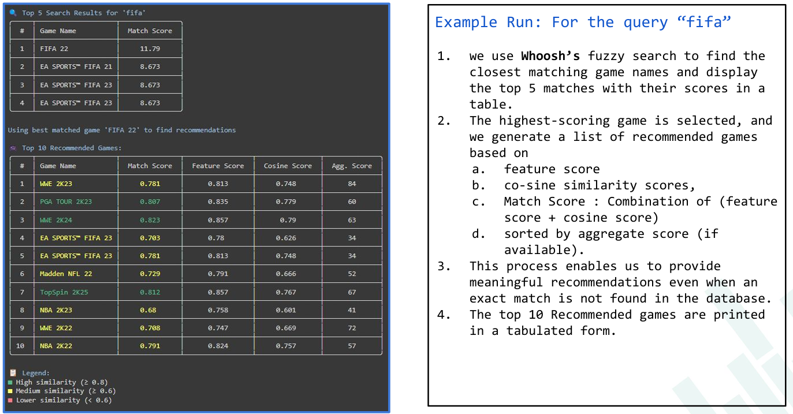
<!-- Add visualization summarizing key results -->

## 📚 References

1. Video Games Recommendation System (Kaggle)
2. Game Recommendations on Steam (Kaggle)
3. Paul Bertens, et al. "A Machine-Learning Item Recommendation System for Video Games"
4. Umair Javed and Kamran Shaukat, "A Review of Content-Based and Context-Based Recommendation Systems"
5. Germán Cheuque, et al. "Recommender Systems for Online Video Game Platforms: the Case of STEAM"

## 📝 License

This project is licensed under the MIT License - see the [LICENSE](LICENSE) file for details.

## 🙏 Acknowledgments

- IIIT Delhi for project support and guidance
- Kaggle and Steam for providing comprehensive datasets
- The gaming community for inspiration and feedback

---
